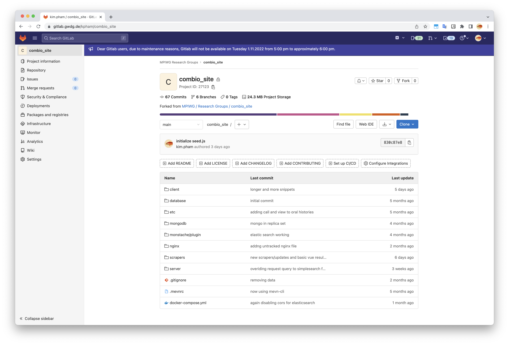
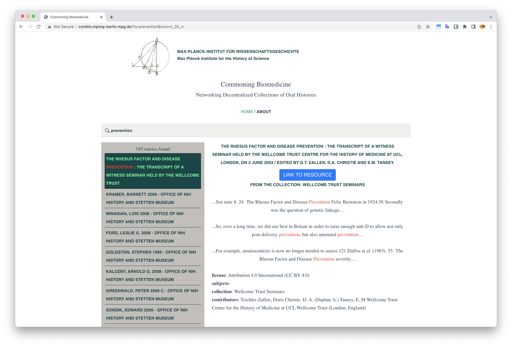

+++
title = "Software project: Biomedical oral histories aggregator"
date = 2022-10-30
description = ""
draft = false
+++

Last updated: October 31, 2022

Used in production at the Max Planck Institute for the History of Science, an app that scrapes (with author permission) and aggregates oral histories in the field of biomedicine, used for historical research. I hired and consulted on the architecture and design on app and work on some parts of the front-end. The frontend uses VueJS set up with MongoDB and Elasticsearch.

The code is available in a private repository in Gitlab for the Max Planck Institute for the History of Science.

