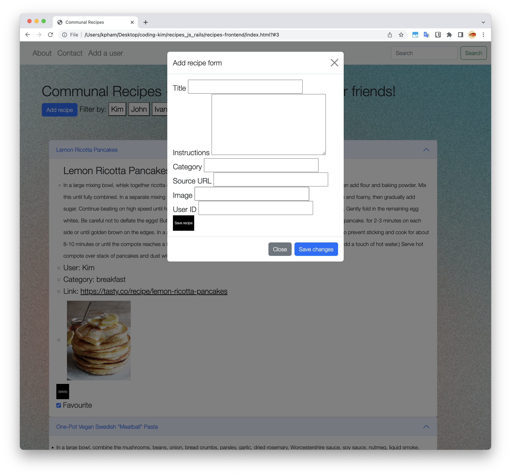

+++
title = "Software project: Recipe sharing"
date = 2022-10-30
description = ""
draft = false
+++

Last updated: October 31, 2022

Github: https://github.com/kimpham54/climbing_logbook_react_rails

An app I built to share recipes with my friends using Ruby, Rails, and plain Javascript. One of my Flatiron School projects.

Some of my coding notes: https://kimpham54.github.io/post/005/

