+++
title = "Software project: Semantic web knowledge graph"
date = 2022-10-30
description = ""
draft = false
+++

Last updated: October 31, 2022

I was the primary designer and developer for this app. We used the open-source platform Researchspace where I worked on the additional customizations and templates and visualizations.

The code is available in a private repository in Gitlab for the Max Planck Institute for the History of Science.

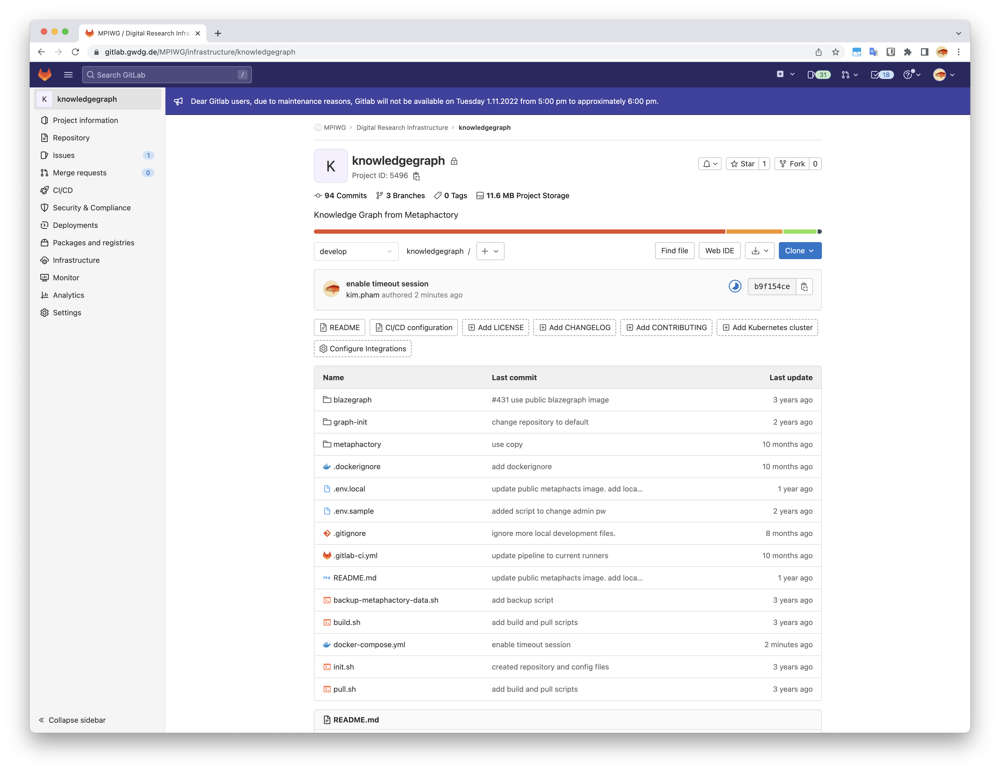
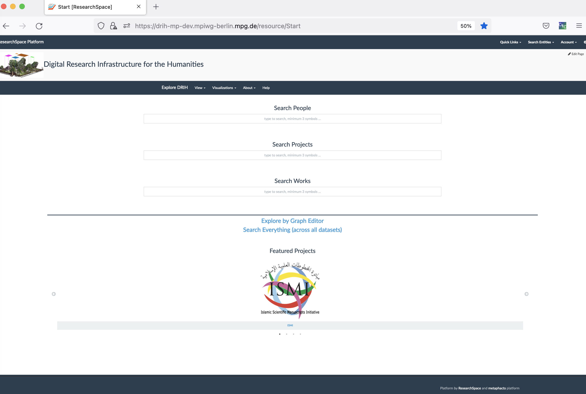
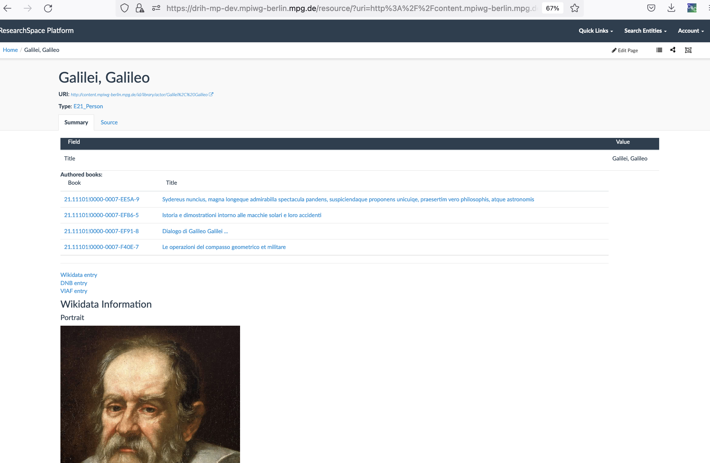
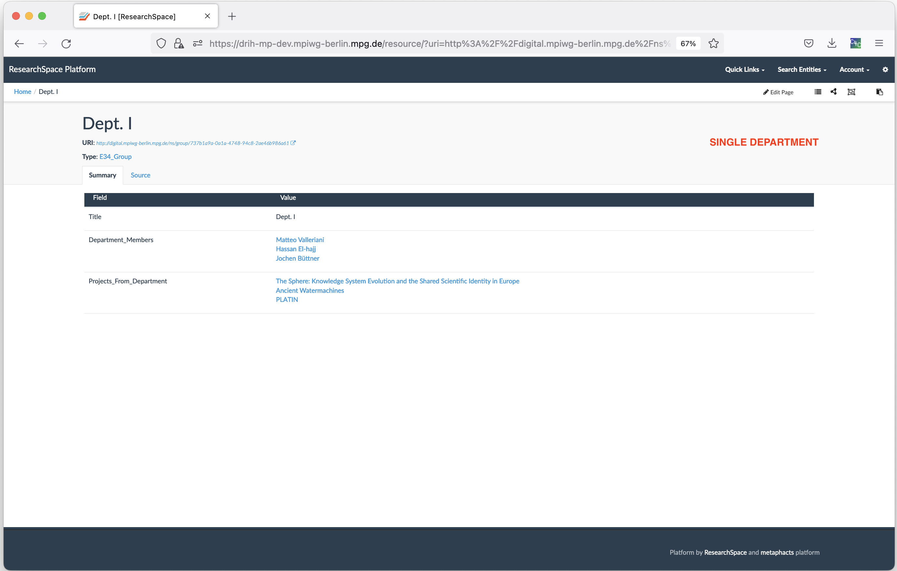
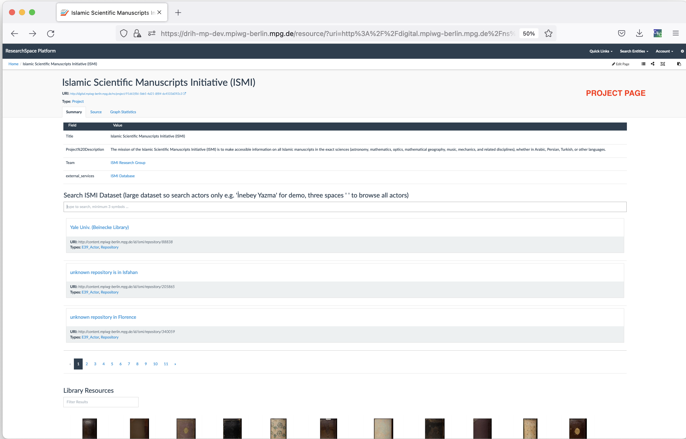
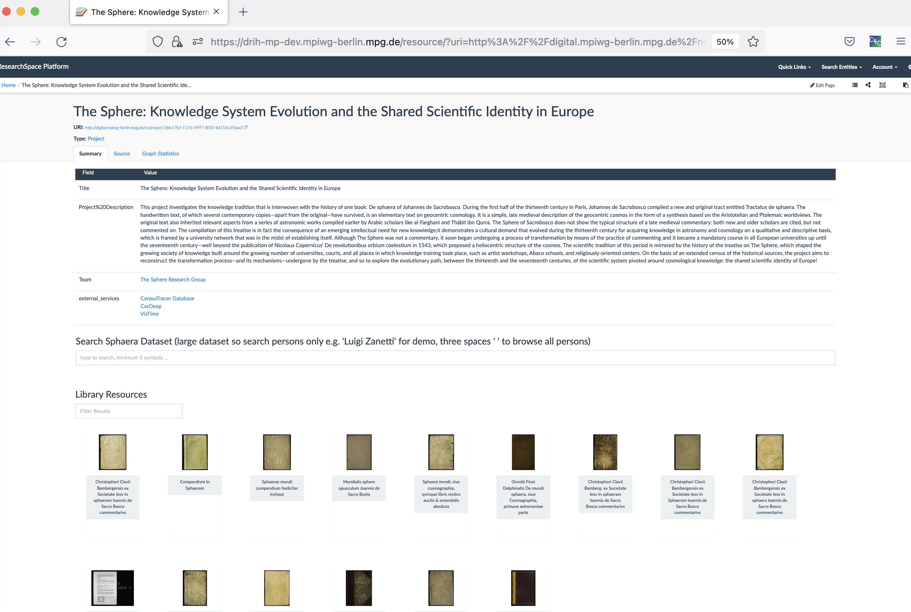
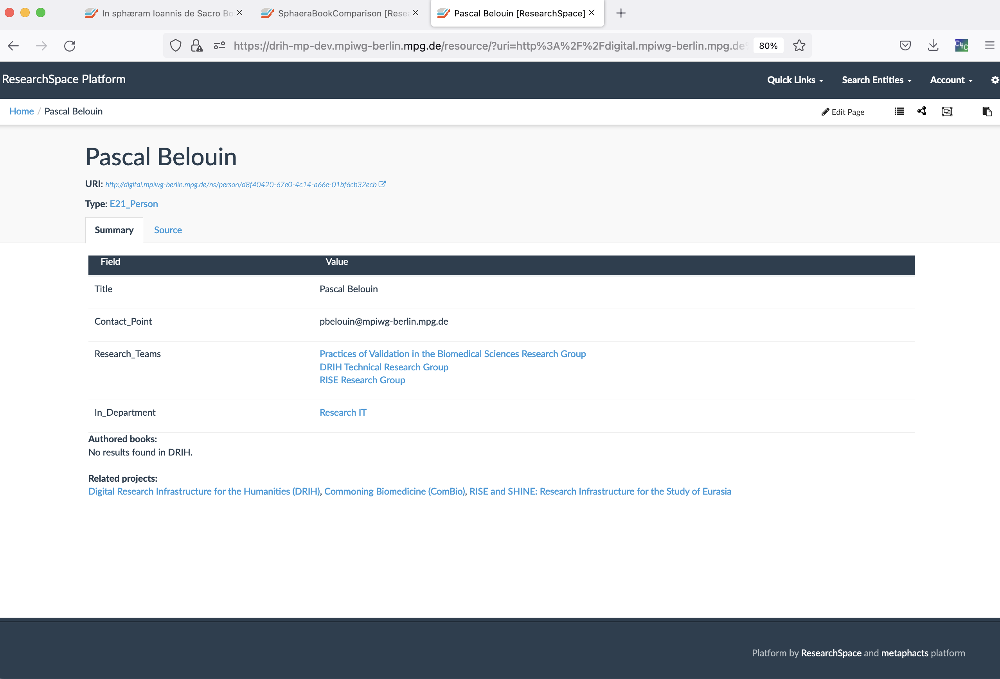
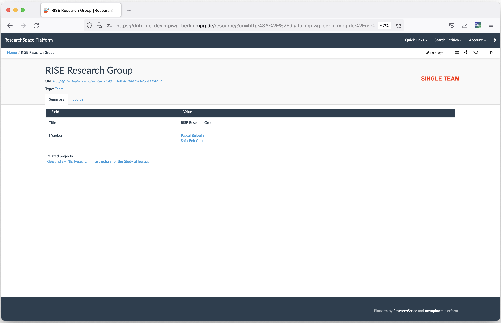

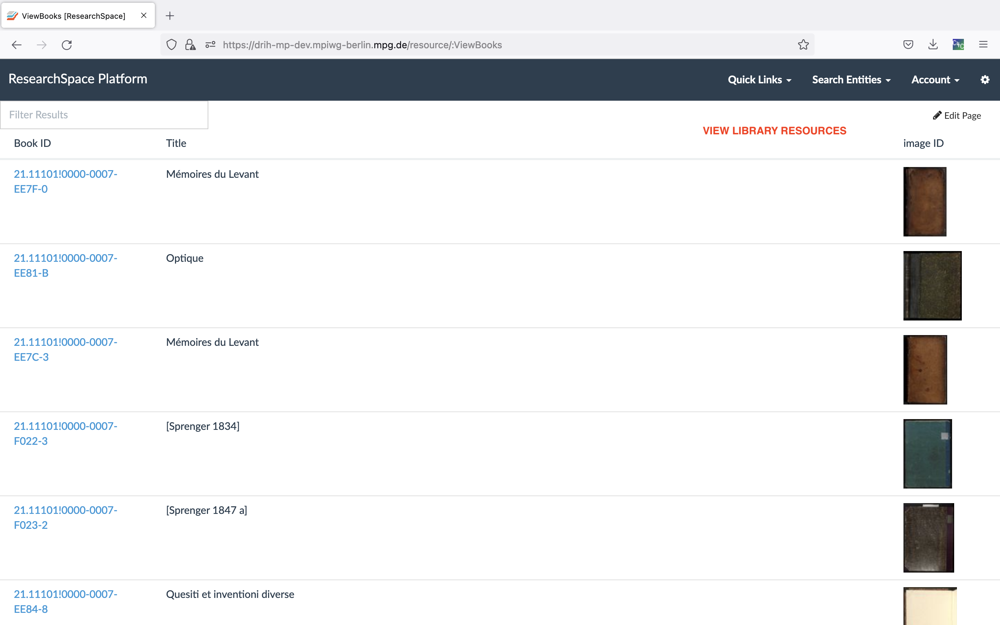
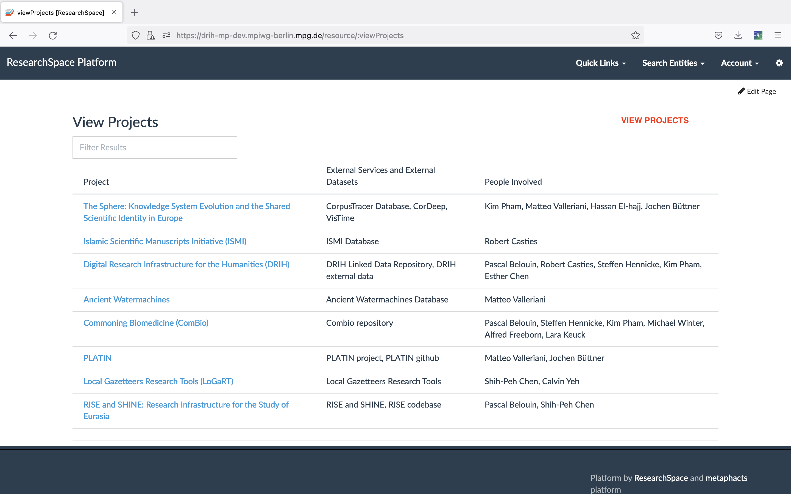
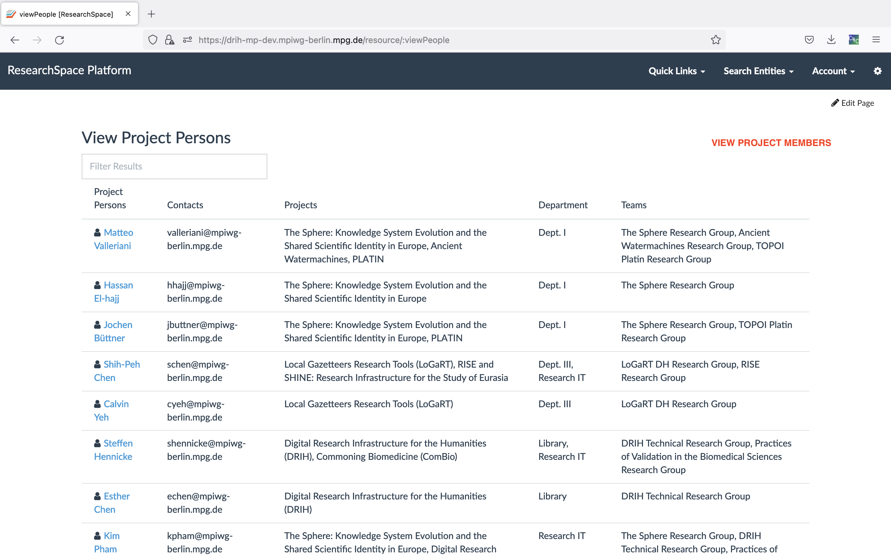
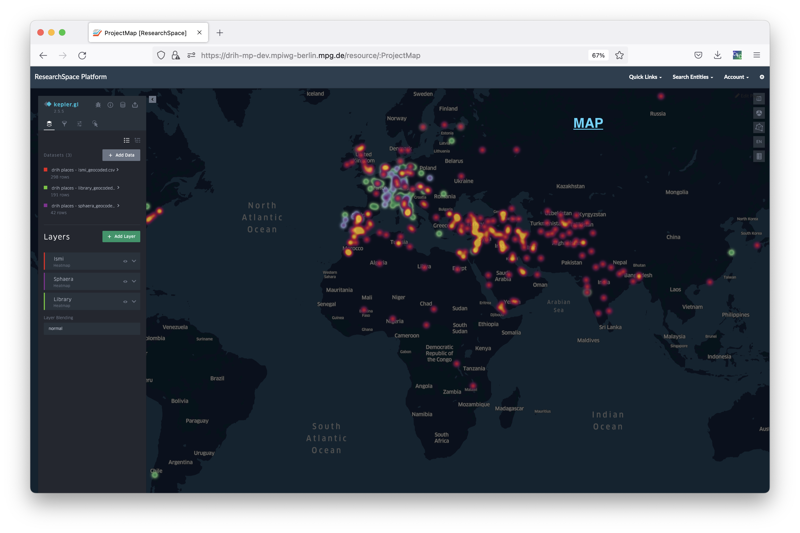
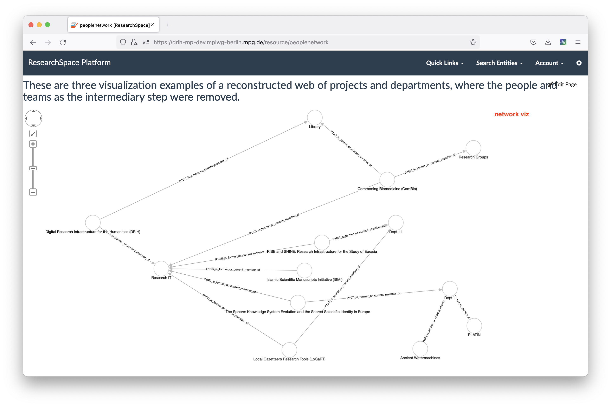
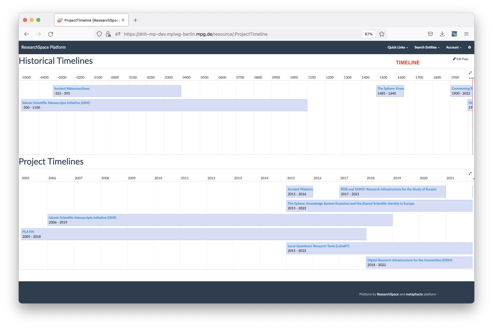