+++
title = "ruby project 001 + updating nokogiri"
date = 2019-05-15T22:42:28-06:00
description = "our cohort is is working on our first portfolio project two months into the flatiron school software engineering part time program. we were asked to create a ruby gem that provides a command line interface to interact with the application that uses an external data source (either by API or web scraping). "
draft = false
toc = false
categories = ["technology"]
tags = ['ruby']
images = [
  "https://source.unsplash.com/category/technology/1600x900"
] # overrides the site-wide open graph image
+++

former title: flatiron school portfolio project 001

our cohort is is working on our first portfolio project two months into the flatiron school software engineering part time program. we were asked to create a ruby gem that provides a command line interface to interact with the application that uses an external data source (either by API or web scraping). we were able to use any external data source we wanted, so i made the obvious choice for myself and decided to scrape [mountain project](https://mountainproject.com), a site that describes climbing routes and locations in north america.

i put the [classic climbs code repository](https://github.com/kimpham54/classic_climbs_cli_gem) up on github with details on how to install and run the application. it's a little object oriented application that scrapes [classic sport climbs](https://www.mountainproject.com/area/classics?type=sport), prints out a list of those climbs, and the user can then select one of those climbs to get more details about it, scraped from a specific climb's page, such as [space boyz](https://www.mountainproject.com/route/106183204/space-boyz) (point of pride note: i climbed this route in march!)

it was a fun exercise to create this application, and it helps that you get to work on content that you enjoy working with. getting to build an object oriented ruby application hardened some of the concepts for me, and helped me think through some of the ways to optimize the program by thinking hard about separation of concerns, improving performance, and trying to be DRY (don't repeat yourself).

i wanted to note one thing, which makes me think about what it means to work in tech or to be a software developer.

the tl;dr: software development is not just about programming and getting your code to work for you, there's many considerations to take into account to say that you have a working application. it's the planning, setting up environment, testing, deployment, security, everything to make your code not only work but continuously operational.

<!--more-->
the tl:

when i finished the application and pushed it to github, i noticed a warning:

<a href="../../images/portfolioproject1-01.png">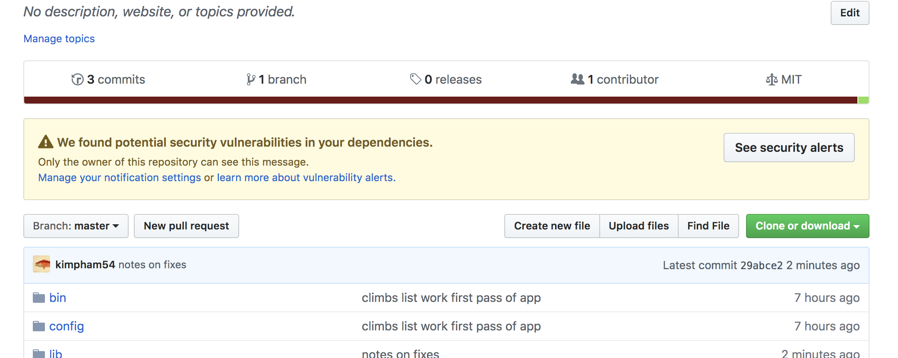</a>

looking into the security alert, it says there is a critical issue with the nokogiri dependency:

<a href="../../images/portfolioproject1-02.png">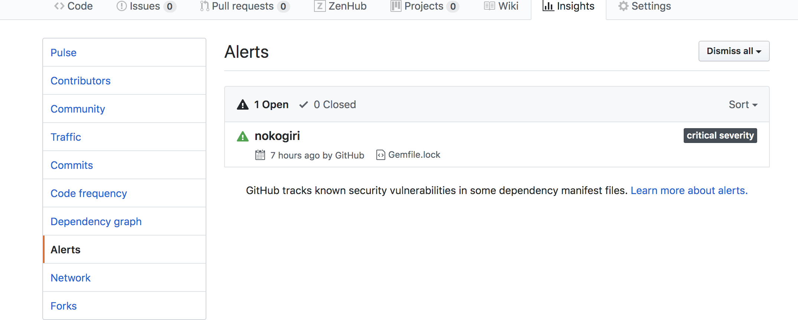</a>

the specific issue with nokogiri is that the version used to build the application is outdated, and it wants us to use a version 1.8.5 or later:

<a href="../../images/portfolioproject1-03.png">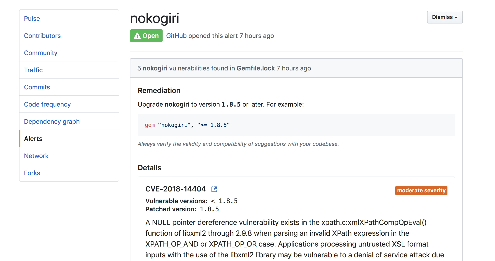</a>

github automatically tracks vulnerabilities in dependencies and provides security alerts to you. ruby is one of the supported languages, according to github it does the following

> GitHub tracks public vulnerabilities in packages from supported languages on MITRE's Common Vulnerabilities and Exposures (CVE) List. We also scan data in public commits on GitHub and use a combination of machine learning and human review to detect vulnerabilities that are not published in the CVE list.

so, github looks at your code and sees if there are any potential security issues based on the maintained list of CVEs. the following CVE is what flagged my application:

<a href="../../images/portfolioproject1-04.png">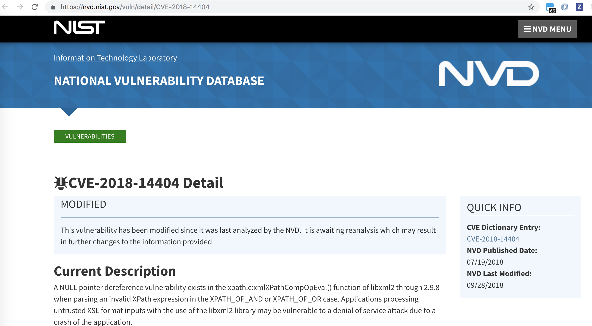</a>

essentially an older version of nokogiri is using upstream libxml2 susceptible to a denial of service attack. any verson of nokogiri past 1.8.5 addresses this issue. i was using my macos built in ruby, which had an older version of nokogiri that it used to build my app:

<a href="../../images/portfolioproject1-05.png">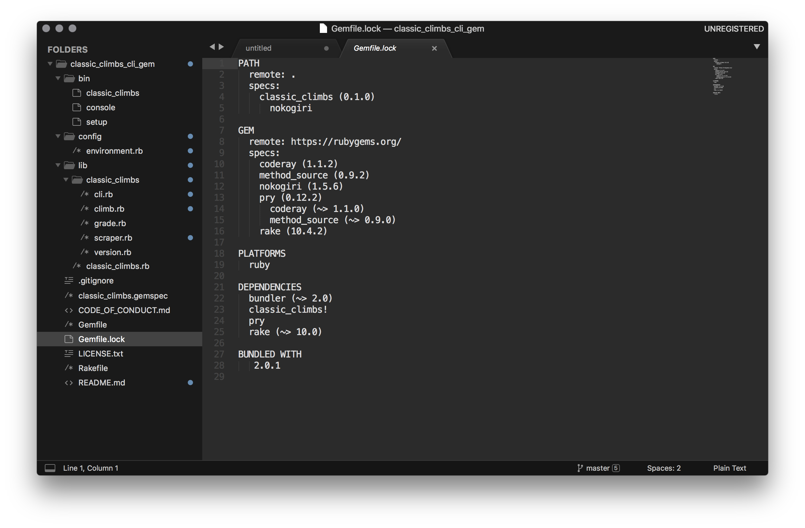</a>

to fix this, i had to update my .gemspec file and specify the version of nokogiri to use (anything newer than 1.8.5):

<a href="../../images/portfolioproject1-06.png"></a>

i deleted the gemfile.lock lockfile to rebuild, but couldn't get a version of nokogiri to build: 
<!-- <a href="../../images/portfolioproject1-07.png">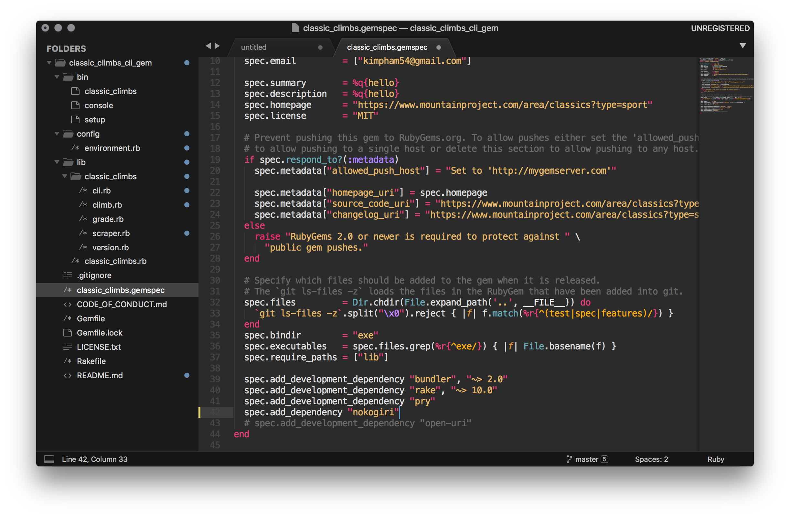</a> -->

<a href="../../images/portfolioproject1-10.png">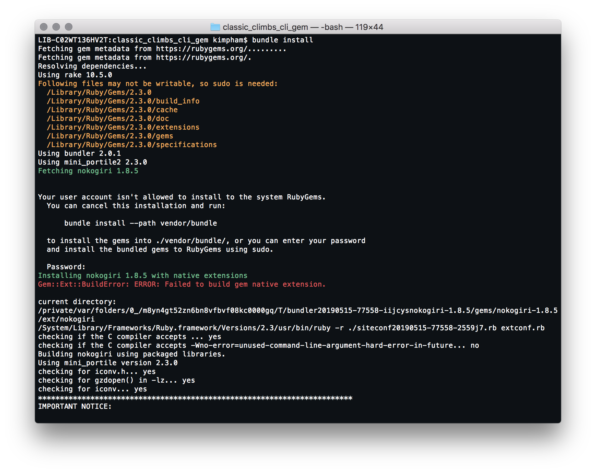</a>

<a href="../../images/portfolioproject1-11.png">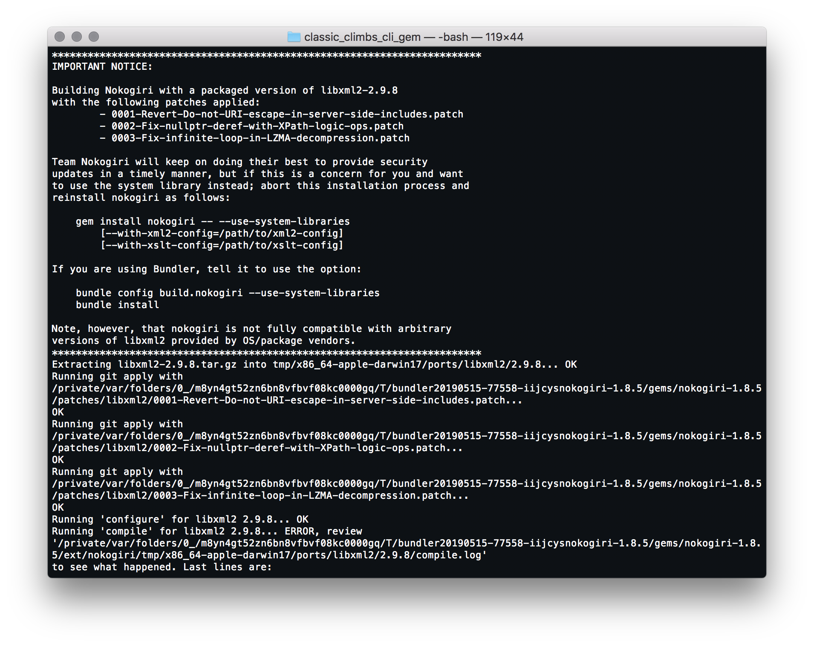</a>

<a href="../../images/portfolioproject1-12.png">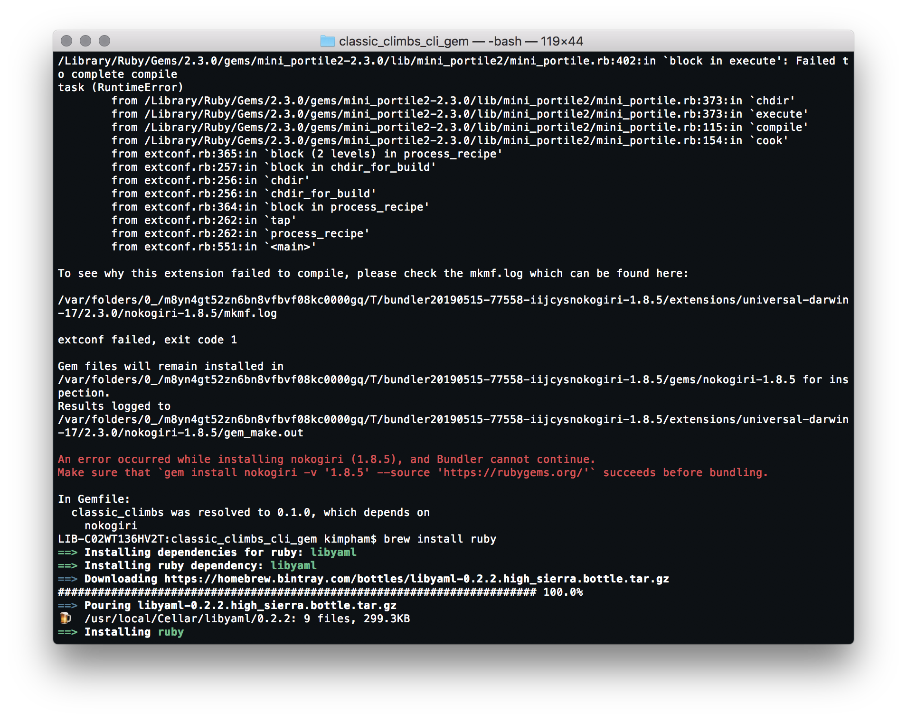</a>

you get notices about version conflicts, incompatibilities galore messages such as libxml2 requires version x.x.x etc. to avoid messing with the the built in ruby environment (a specific package in a specific version might be used elsewhere in the system), i installed my own ruby environment via brew instead:

<a href="../../images/portfolioproject1-09.png">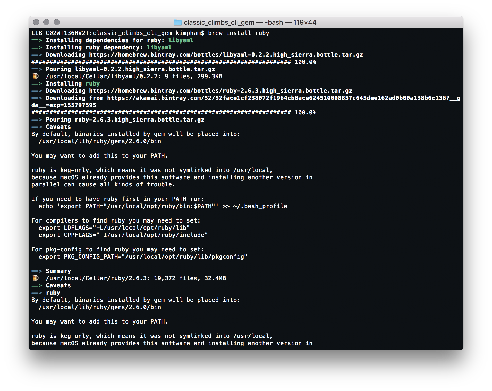</a>

ran ```bundle install``` again, and this time it worked:

<a href="../../images/portfolioproject1-08.png">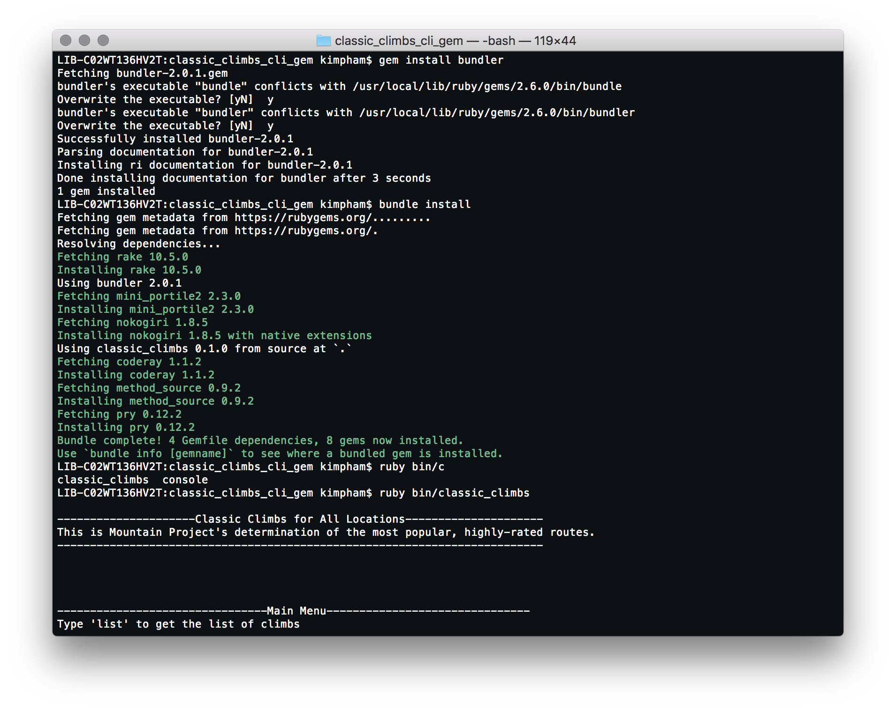</a>

took a look at my lockfile, and you can see that the nokogiri version has been updated:

<a href="../../images/portfolioproject1-13.png">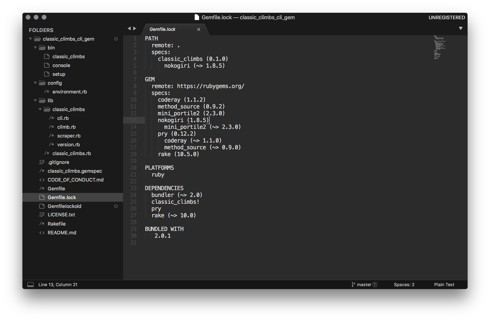</a>

finally, i pushed my code up to github and the security notice went away. yaaaas! but then, nooooooooo:

```$ .bin//console```

``` You must use Bundler 2 or greater with this lockfile.```

upgrading made my ruby console break. so i'm trying to figure that out!

so. being a developer is not just coding, it's having an understanding of the environment you're working in and all of the moving pieces that are involved. thinking about the security of your app and the environment, its versions and dependencies, how to test and monitor your application and do this is in a consistent, sustainable way. having a sense of all of these processes i'm assuming can only make you a better developer.

<!-- <a href="../../images/portfolioproject1-14.png">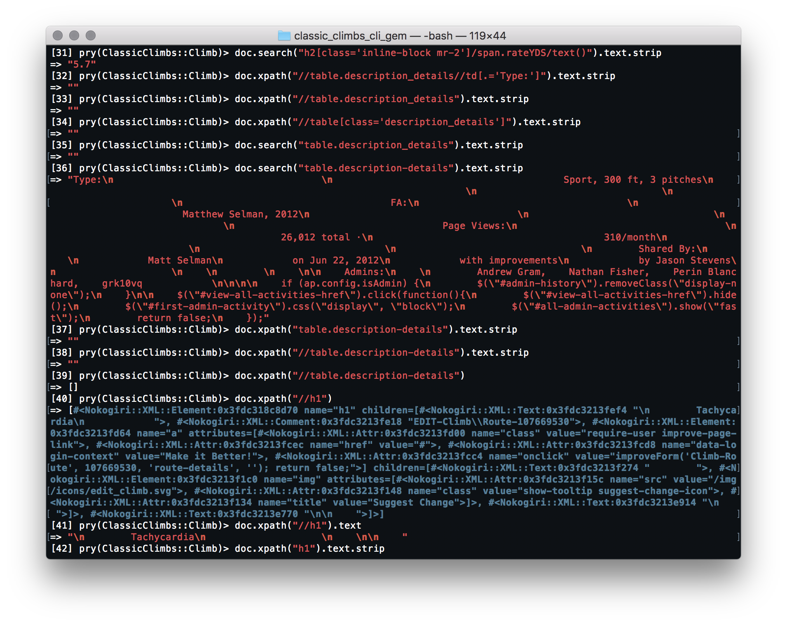</a> -->


<!--  -->