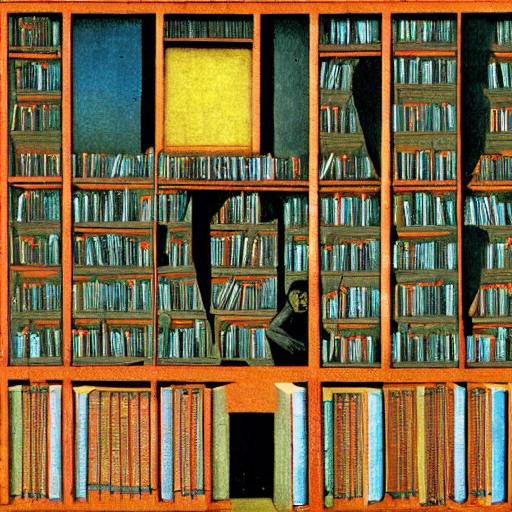
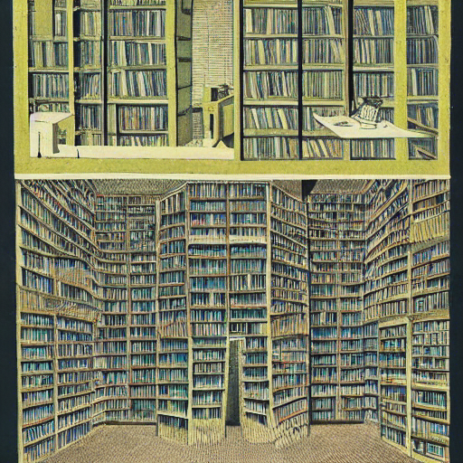
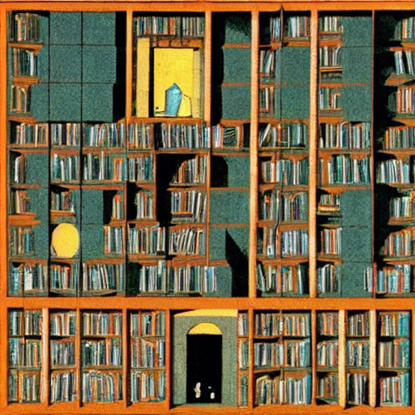

+++
title = "machine learning + stable diffusion"
date = 2022-09-29
description = "ai generative art and the beauty of latent space travel"
draft = false
toc = false
categories = ['technology']
tags = ['machine learning', 'open source', 'stable diffusion']
images = [
  "https://source.unsplash.com/category/technology/1600x900"
] # overrides the site-wide open graph image
+++

on a sunday, some sundays ago, i took my quiet night as a cue to nerd up, so i downloaded stable diffusion and played around with it. i read [a beautifully written piece about machine learning by jon stokes](https://www.jonstokes.com/p/ai-content-generation-part-1-machine), setting aside any political views, which was deeply moving and really made me want to play around with it.

the setup is simple, you (my non-existent reader) can use the colab notebook i pasted below, or to install it on your local, you can follow my already going to be outdated in october 2022 steps that i followed from [@levelsio](https://twitter.com/levelsio) who followed that from someone else:

```
- Upgrade MacOS to the latest version (top left 🍎 -> About This Mac -> Software Update
- Open Terminal app
- Install Homebrew from http://brew.sh

⌨️ Type the commands below in terminal and press Enter:

brew update

brew install python

git clone -b apple-silicon-mps-support https://github.com/bfirsh/stable-diffusion.git (remove the linebreak before the URL here)
cd stable-diffusion

mkdir -p models/ldm/stable-diffusion-v1/

python3 -m pip install virtualenv

python3 -m virtualenv venv

source venv/bin/activate

brew install Cmake protobuf rust
pip install -r requirements.txt

⬇️ Now go to https://huggingface.co/CompVis/stable-diffusion-v-1-4-original, read and understand the license, then click "Access repository"

Download sd-v1-4.ckpt (~4 GB) and save it under stable-diffusion/models/ldm/stable-diffusion-v1/model.ckpt

python scripts/txt2imgnsfw.py --n_samples 1 --n_iter 1 --plms --precision full --ddim_steps 50 --prompt "a library with hexagonal rooms where one person is living in each room and in the library every conceivable book exists. illustration by Max Ernst, in the style of Jorge Luis Borges, 8K"
```

the cosmos (or latent space) of stable diffusion is a set of 5.85 billion CLIP filtered image-text pairs (LAION 5B), it could stand in as an approximation of the intellectual and physical world, i actually think it's very likely it would given the sheer amount of data provided. we're giving the machine prompts, it's dissecting said prompt in this space, and retrieving an image approximation of said prompt. borges and calvino are always very casually in my mind, they're words, dreams, symbols are always there in my short and long term memory. reading jon stokes conjured up these images, and being a former librarian i felt like placing them as the protagonist, the precogs (minority report) that are your guide to navigate this new space. how cool that would be if librarians took the helm!

> playing with stable diffusion + imagining librarians living parallel lives as prompt generators searching + refining through the latent space where every possible digital combination already exists, you just have to find it. perhaps borges would be pleased. #stablediffusion

> dear latent space traveller, explorer of internal memory, seeker into infinity. the stalker that knows how to tease out the perfect configuration of bits. it was never databases it was always concepts, edges, features

> 'what we observe is not nature in itself but nature exposed to our method of questioning' quote werner heisenberg. the librarian, questioning its faith that our texts model the world. brave your new domain, the visions of our experience of models of reality. 

> O brave new world, that has such people in it!

i made some borges library like photos. him and calvino would be fascinated by the technology! calvino even tried to collaborate with an ibm technologist William Skyvington, but Skyvington wrote in a letter accusing Calvino of 

> "seeing computers as mere tools and not as the complex technologies they were."

> "computers should be treated like “real women” and not “prostitute”" (ok comment for the time i suppose?)

art is the lifeblood and livelihood of the lucky few, and for them to lose that is sad, it's quite lucky to have your passion be your income stream and if someone has that opportunity i'd hope that it wouldn't be taken away. but the argument that it devalues or debases art i don't think rings true. i remain hopeful, my twitter-rage inducing comment here is that on a macro level humans are incredibly resilient and adaptive (see COVID-19). if you read enough historical documents and about peoples lives throughout history dating back to the classical greek period, people are still struggling with the same problems, same moral values, same virtues. it almost feels like life isn't any different, not any better or worse, the world finds an equilibrium despite tragedy chaos, it doesn't last forever. 

here is a more thoughftul comment, and why i also think art can never die:

> There's no algorithm that generates artistic meaning. These neural nets allow you to employ arbitrary styles and techniques, but no AI can't come up with meaningful messages on its own...yet

> I think of meaning in terms of Saussure's sign and signified. "The Earth orbits around the sun" for example, is literally a string of characters. As a sign, however, its correspondent signifier could be a diagram of the solar system or something like that.
In general meaning is the parts of an experience that are salient to its representation as a sign. It's a sign's signified.

> Robots lack an embodied experience that would be necessary for them to understand human meanings. They don't know what it feels like to step on a Lego, so a whole class of memes and meanings are unavailable to them as a result.

> There are probably things that we, as humans, don't know that we feel but still impart meaning. It would be very hard to get a robot to say something like "as the blood rushed to my ears" in a truly meaningful way. Most who end up using that phrase in a sentence don't use its full meaning when thinking about it (so there's higher than normal pressure in the head, etc) but if pressed can expound on it in a way that would be obviously different than a robot's (GPT3 would say, the meaning of this sentence is [0.5435, 24.2352, 1.3245], nearby sentences I've seen have embeddings [1.5532, 0.3552, 4.2442])






References

- https://colab.research.google.com/drive/12l_Wq4km2nLXHZDo3RyzeFTnTnXq0aiu 
- https://twitter.com/levelsio/status/1565731907664478209 
- https://laion.ai/projects/
- https://narratingcomputing.com/microhistories/constellation-italo-calvino/
- https://news.ycombinator.com/item?id=32486133
- https://www.jonstokes.com/p/ai-content-generation-part-1-machine
- https://simonwillison.net/2022/Sep/5/laion-aesthetics-weeknotes/