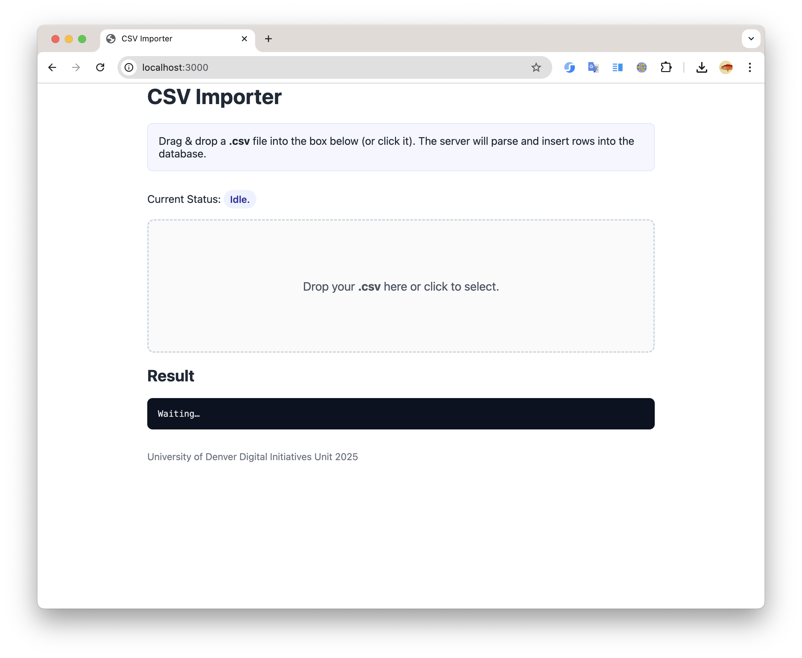
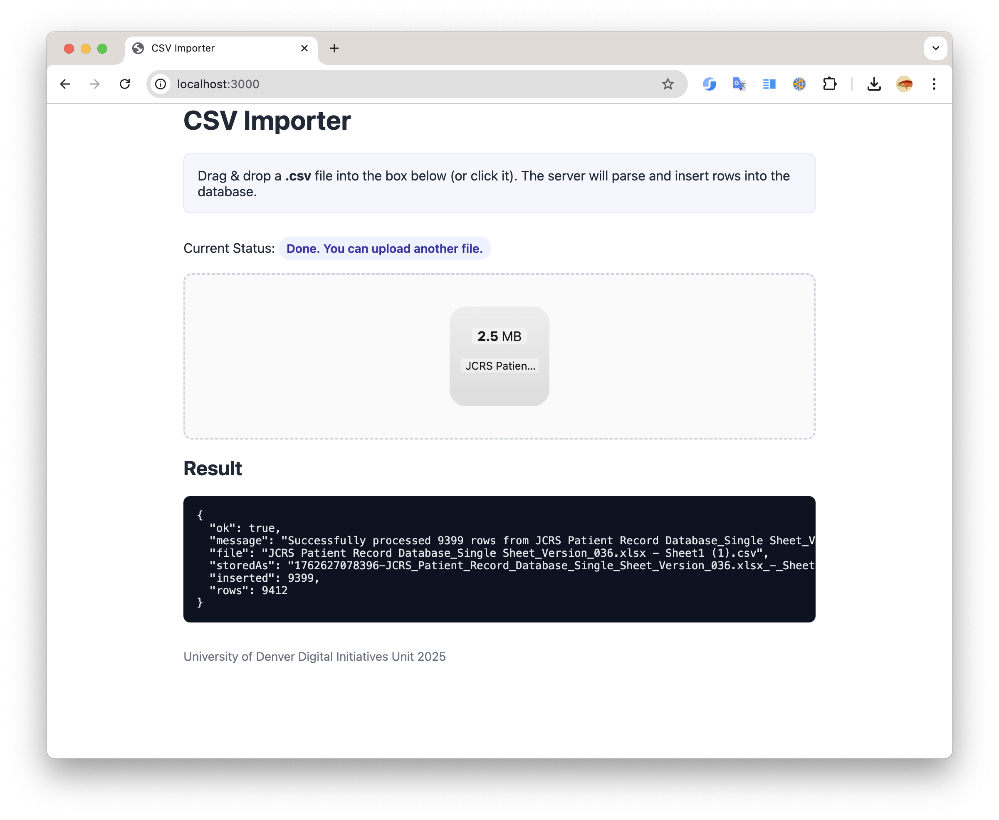
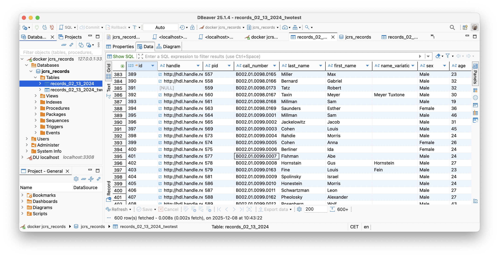

+++
title = "an express and nodejs CSV importer service"
date = "2025-12-07T01:15:41-04:00"
description = "jcrs csv"
draft = true
toc = false
categories = ["technology"]
tags = ["nodejs", "javascript", "REST api"]
+++

JCRS csv importer

https://github.com/kimpham54/jcrs-csv-importer
https://github.com/dulibrarytech/jcrs-csv-importer
had a docker mariadb so i didn't have to install it