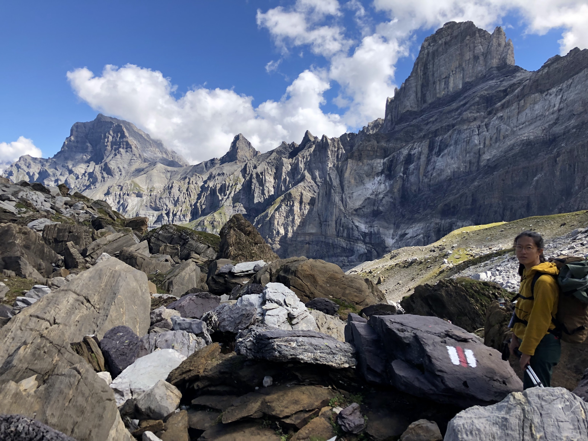
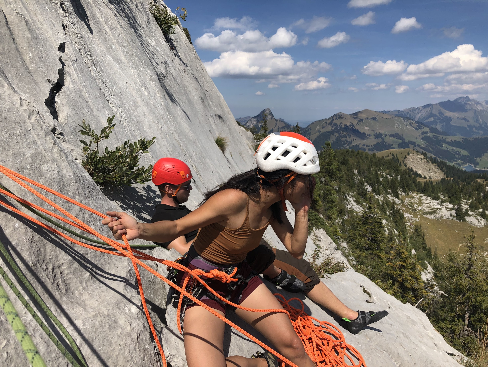
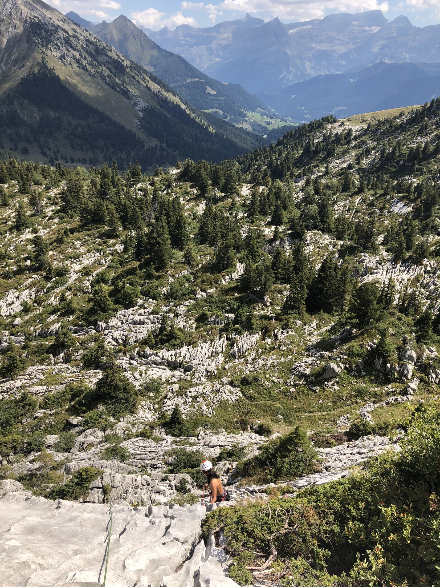

+++
title = "climbing in the western alps of switzerland"
date = 2022-08-29
description = "a brief about my trip with my friends in west switzerland"
draft = false
toc = false
categories = ["personal"]
tags = ['climbing']
images = [
  "https://source.unsplash.com/category/technology/1600x900"
] # overrides the site-wide open graph image
+++

i just came back from a hut and climbing trip in west switzerland. i have a six year relationship with climbing, and we're pretty comfortable with each other, but in many ways we are still figuring things out. it's hard to overcome my fear of a bad fall, but i do love the challenge of managing that fear. i take it easy, i'm not in a rush to be the best. it's something i want to do for a long time. it was partially my decision and knowing what i want out of climbing, and partially coming to terms with the limits of myself and the time i want to devote to climbing vs other things i care about. and i am satisfied.

hiking hut to hut with Thomas, Pierre, Chantal, Kevin, Esmé

bus stop Les Plans-sur-Bex > hut Cabane de la Tourche > hut Pont de Nant > bus stop Solalex

climbing in Leysin with Kevin, Sam, Rahma

we did La Berneuse (taking a gondola), Les Plans (taking a taxi), and Pierre du Moëllé (taking a taxi)

