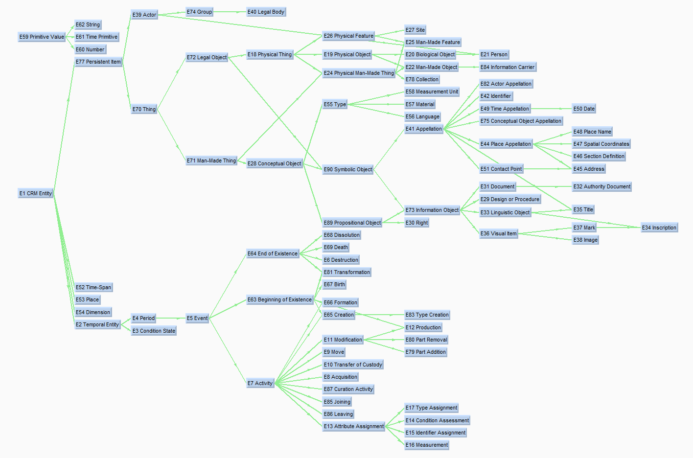

+++
title = "ontology coordination with sparql"
date = 2022-09-30
description = "have you heard of web3.0? it's been here since 2004!"
draft = false
toc = false
categories = ["technology"]
tags = ["sparql", "semantic web", "javascript", "reactjs", "open source"]
images = [
  "https://freight.cargo.site/t/original/i/3fa2878864ee88e60ba954c94415119cefe999c2655e84e10ee555ccabc896b2/whibley_3_o.jpg"
] # overrides the site-wide open graph image
+++

isn't it beautiful? it's web3.0!

(extensive amounts of CIDOC CRM usage not included in photo)

my colleagues and i are working on building up the semantic web, that is, web 3.0, or linked data. you may be familiar with its blingy $$$$ counterpart web3, but web3.0 had the catchy name first point O!

but wait, what's the difference? everything darling, web3.0 and web3 has some inklings of a shared decentralization mission, but the ecosystem is entirely different. says the w3c:

> the Semantic Web provides a common framework that allows data to be shared and reused across application, enterprise, and community boundaries

super vague i know. but just know that a lot of the tooling and standards are designed to faciliate sharing, reuse, and access to data. it's a standard that provides for standard tooling, and shared understanding of how to use data across (and in spite of) built systems. it's graph shaped, a little web or network of data, rather than grid or table shaped, like most database structures.

the interest in the semantic web still largely resides in academia. i can't tell if it's growing or shrinking. in north america it felt like it was fading, in europe/germany it's still fun and cool! 

i'm trying to make my posts brief, i really just want to keep a record of my technical activities, so in short, linked data powers our system, and SPARQL replaces the SQL crown to retrieve data. i've been working on the design and coding of our system, which uses the open-source ResearchSpace/Metaphacts Open Platform, making frontend teampltes and react components to interact with our wild data structure (we are combining data from different projects using CIDOC CRM, this even more wildly esoteric ontology model that describes cultural heritage information (describing its intellectural and physical forms) then trying to link some shared data together and then slapping on a layer of metadata over that).

sometimes i wonder, i really, really wonder, how i will be able to apply what i've learned outside of an academic context. but it feels good, working with SPARQL. CIDOC CRM maybe not, the modelling complexity is a bit too much, but i see the value in the semantic web, wikidata + wikipedia being a prime example of this. sharing your knowledge, making it accessible and reference-able in whatever form, it doesn't have to be strict w3c standards, but to have the semantic web mentality is probably the most important takeaway. maybe ai will create so much of everything that all tihs data will get lost in the noise. or maybe it's playing the long game, could be it's here to stay, all of these technologies that change and break and move on, and linked data will remain strong, data imbued with semantics and meaning and we'll all sitting around making SPARQL queries to get at this precious, precious, trustworthy data. LONG LIVE SPARQL

btw here's CIDOC CRM. ok it's not so ba-----

oh wait, that's just the higher level. 

i see.

i see.

i see.

...and it goes on. but here's a nice simple depiction of it. i gotta say, it's kind of cool the data linkings and connections you can make if everyone's using it!

