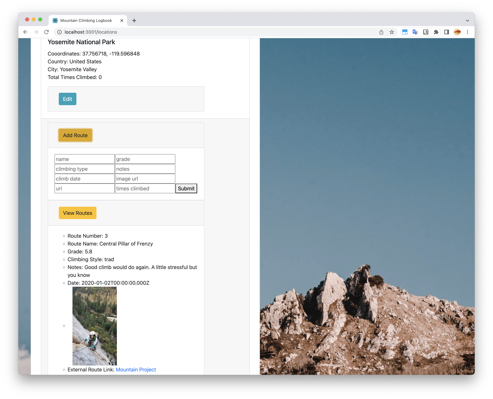

+++
title = "Software project: Climbing logbook"
date = 2022-10-30
description = ""
draft = false
hideDate = true
+++

Github: https://github.com/kimpham54/climbing_logbook_react_rails

An experimental React app that I worked on as part of the Flatiron School bootcamp. The focus was on creating complex data routes with Redux and hierarchical data organization. You can create climbs, and within those climbs you can create routes, and tally your routes up per climb.

Some of my coding notes: https://kimpham54.github.io/post/006/

